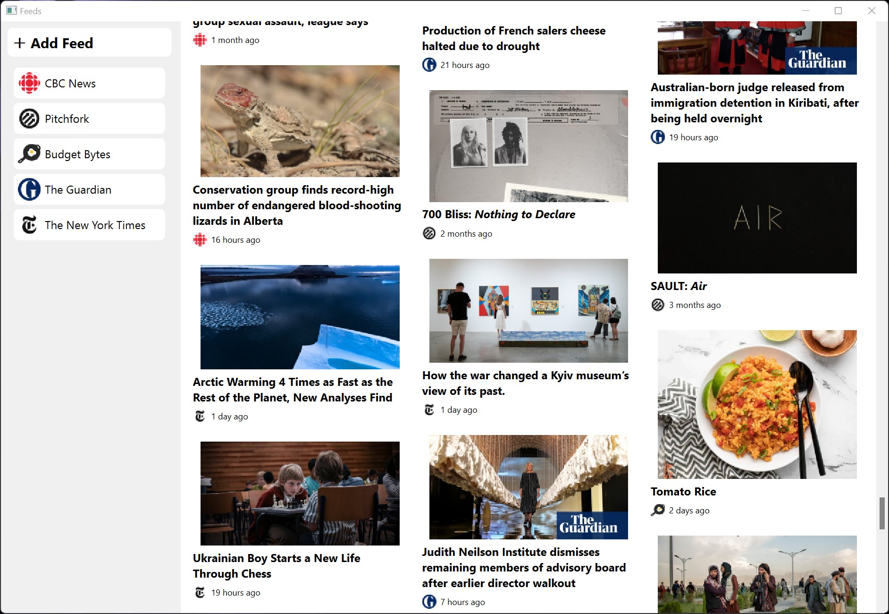

# An RSS/Atom Feed Reader

## Features

 - Add news feeds with any valid RSS/Atom feed URL.
 - Browse all feed entries in an image card layout.
 - Read entries in a clutter-free reader view.
 - Filter out entries from any added feed.




## Reflection

This project was somewhat of a challenge for me at first.
I first wrote this program as a final project for a programming course in high school,
and it came out pretty well. I then left it for almost two years before deciding to revisit it.
On looking over the code base again, I realized I had forgotten about most of the code I had written.
I had wanted to make the UI a bit cleaner, and also wanted to add more features and increase stability.
I was tempted to rewrite the whole thing from scratch, but I decided to work with what I had.
Much time was spent reading through the code trying to understand it.
I added documentation as I went, which helped with the process.
Finally, after getting a general idea of how the code base functioned,
I got to work refactoring it. I had learned a lot about software engineering in two years,
and I was definitely questioning some of the design decisions that my past self had made.

One major change I made was reworking how fetching articles worked.
The old program used a blocking API that would freeze the entire GUI when articles were fetched
from the network. The new program is asynchronous in its fetching procedure, so the user can still
use the GUI while the application fetches articles in a background thread.
The GUI itself was also cleaned up and now included picture thumbnails.
A lot of code was refactored to make the overall application more efficient.
Filtering out a feed in the old program froze the UI for a couple of seconds.
In the new program, it is almost instant.

Overall, the key takeaway for me was that of code maintainability.
I now appreciate writing code that is documented, easy to understand, and easy to extend. 
It is also a courtesy to my future self that may have to revisit the project some time.

If I were to work on this project further, I would add a summary feature that generates a summary from
an article entry. I'm aware that one of the project's dependencies already provides a feature for summarizing
articles, but I'd like to write my own algorithm as I think it'd be an interesting challenge.

## Running

Clone the repository:
```
git clone https://github.com/lainv10/feeds.git
cd feeds
```

Run with `python`. This project was developed using Python 3.10. A virtual environment is recommended.
```
pip install -r requirements.txt
python feeds
```
